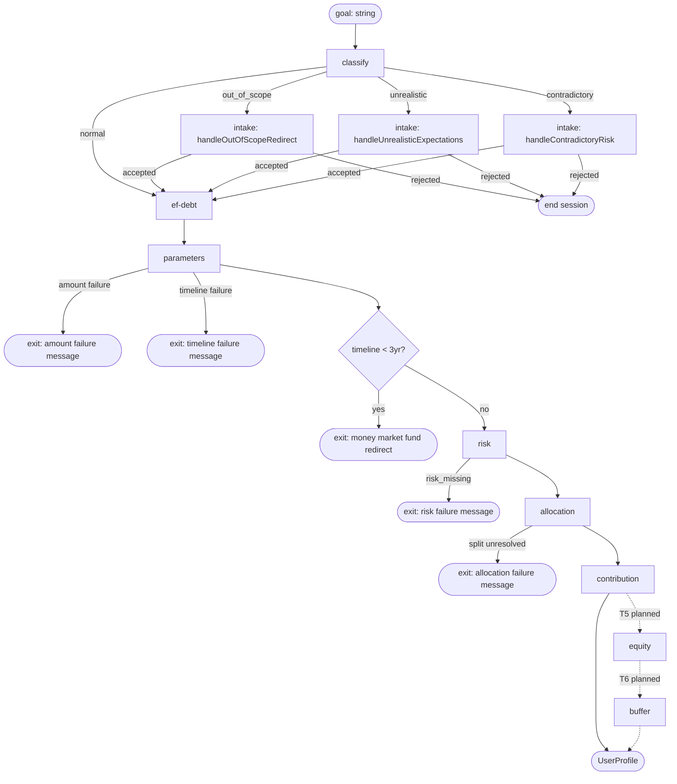

# Lazy Advisor — Architecture

An agentic investment planning CLI for beginner ETF investors. Inspired by the Israeli "Lazy Investor" philosophy — invest in ETFs, set up monthly contributions, stick to the plan, don't overthink it.

> Educational/demonstrative project — not a licensed financial advisor. Target audience: beginner investors getting started, not experienced traders.

## Pipeline Overview

Stage behavior, prompts, and rules are co-located with the stage at `src/server/pipeline/stages/clarify/`.



| Phase | Job | Input → Output |
|-------|-----|----------------|
| classify | Label the goal: `normal`, `out_of_scope`, `unrealistic`, or `contradictory` | `goal` → `GoalClassification` |
| intake | Redirect misclassified goals; reject if user declines | `goal`, classification → `IntakePhaseOutput` |
| ef-debt | Educate/warn about emergency fund and high-interest debt; gate before parameter collection | — → (educational gate, no profile output) |
| parameters | Collect core profile parameters via conversation | — → `ParametersPhaseResult` |
| risk | Elicit a 1–5 self-rating of comfort with temporary drops; map deterministically to `conservative`/`moderate`/`aggressive` | `ParametersPhaseOutput` → `RiskPhaseResult` |
| allocation | Size the total-portfolio equity/buffer split from a 2-axis (risk tolerance × timeline) anchor table | parameters, risk → `AllocationPhaseResult` |
| contribution | Establish one-time vs. periodic intent | parameters, allocation → `ContributionPhaseOutput` |
| equity | *(T5 — planned)* Resolve which equity instruments fill the equity bucket + within-equity split | parameters, risk, allocation, contribution → `EquityPhaseOutput` |
| buffer | *(T6 — planned)* Resolve which buffer instrument fills the buffer bucket | parameters, risk, allocation, equity → `BufferPhaseOutput` |

Phases use one of two conversation patterns depending on whether the LLM needs to drive the conversation or just classify a fixed question — see [Phase conversation patterns](#phase-conversation-patterns) below. A `*.rules.md` file is co-located with each phase as the behavior spec that drives prompts and evals. Cross-phase primitives — schemas, constants, types, and shared helpers — live under `clarify/shared/`.

---

## Design Decisions

### Multi-phase split

Splitting by responsibility keeps each prompt short and focused, improving instruction-following. Phases are decoupled: they receive plain typed inputs from the orchestrator rather than accumulating conversation state across boundaries. Evals are more targeted — each phase is tested independently, assertions are tighter, and failures are easier to isolate.

### Classify + intake routing

Some goals require handling before parameter collection: stock-picking requests need an ETF redirect, unrealistic return expectations need a reality check. Embedding that branching in the parameters prompt would create a mega-prompt where routing logic competes with parameter-collection instructions, degrading adherence.

The solution: move routing into code. A lightweight classifier (`classifyGoal`) makes a single structured LLM call and returns one of four values — `normal`, `out_of_scope`, `unrealistic`, or `contradictory`. Code routes to the appropriate intake phase before parameter collection:

```
"Should I buy NVIDIA stock?"
  → classifyGoal()             → out_of_scope
  → handleOutOfScopeRedirect   → IntakePhaseOutput { accepted: true }
  → collectEfDebt()
  → collectParameters()
  → collectRisk(parameters) → collectAllocation(parameters, risk) → ... → UserProfile
```

Each intake handler lives in its own subfolder under `clarify/intake/` alongside its evals. Each is a sub-agent: its own system prompt, its own `runPhaseLoop`, and a typed `IntakePhaseOutput`. Acceptance is determined by a post-loop structured LLM call:
- `{ accepted: true }` — user accepted the redirect; orchestrator continues to parameter collection
- `{ accepted: false }` — end the session; stage sends a per-classification closing message from `INTAKE_REJECTION_MESSAGES`

The parameters prompt is left with one job: collect required profile parameters.

An alternative considered: skip the classifier and expose handlers as LLM tools, letting a top-level agent route via tool call. This breaks down because the handlers are multi-turn conversations — the outer agent would just wait, making it an expensive classifier with no upside. Explicit code routing after a lightweight classifier is cheaper, independently testable, and observable in isolation.

(The `contradictory` classification is kept despite the risk phase's self-rating resolving the stated contradiction — surfacing the conflict up-front has educational value for beginner users.)

### Parameters — hard exits on missing data

`collectParameters` returns `{ status: "failure", code: "amount_missing" }` if the user cannot provide a valid investment amount after two attempts, and the stage exits immediately. Every downstream phase is shekel-denominated — allocation splits, contribution framing, and equity/buffer amounts all depend on a concrete number. Timeline shares the same hard-fail pattern (T3.7): if the user cannot provide a specific timeframe after two attempts, `collectParameters` returns `{ status: "failure", code: "timeline_missing" }` and the stage exits. Timeline is the other axis of the allocation anchor table; a guessed timeline produces a wrong equity/buffer split.

### Short-horizon early exit (timeline < 3 years)

After parameters collection, the orchestrator checks `parameters.timeline`. If it is `"under 3 years"`, the stage exits immediately — sends a money market fund redirect and returns `null`. ETFs carry too much timing risk for money needed within 3 years: a market drop right before the funds are needed is hard to recover from in time, and risk tolerance is not a meaningful variable at that horizon (Vanguard, Fidelity, Bogleheads).

### Risk phase — single 1–5 self-rating

The risk phase asks one question: a 1–5 self-rating of comfort with seeing investments drop temporarily, with behavioral anchors at 1 ("very uncomfortable — I'd want to sell immediately"), 3 ("neutral — I'd be uneasy but try to hold"), and 5 ("completely comfortable — I'd see it as a buying opportunity"). The integer maps deterministically in code: 1–2 → `conservative`, 3 → `moderate`, 4–5 → `aggressive`. The post-loop extraction returns only `selfRatingScore`; `riskTolerance` is computed in TypeScript, not by an LLM.

**Why direct self-rating, not hypothetical drop scenarios.** Risk-tolerance research (Statman, Kitces, CFA Institute *Psychometric Review*) shows direct self-rating has higher predictive validity than hypothetical scenarios, and historical-recovery framing is a documented priming bias. An earlier two-turn A/B design also exhibited an intermittent adherence flake (~1 in 3–4 runs); the single-question shape removes the multi-step flow structurally. Full trade-offs and rejected alternatives in [`clarify.risk.research-notes.md`](../src/server/pipeline/stages/clarify/risk/clarify.risk.research-notes.md).

**Hard-fail on unresolved.** If the phase budget (3 tool calls) is exhausted without a valid 1–5 score — whether from invalid answers or from a clarifying question consuming turns — `collectRisk` returns `{ status: "failure", code: "risk_missing" }`. The same result occurs if the LLM ends the phase silently and the extraction subsequently returns null. The stage exits with a closing message rather than defaulting to an assumed risk tolerance — risk tolerance is the other axis of the allocation anchor table, so an assumed value produces a misleading allocation. Mirrors the T3.7 pattern for `timeline_missing`.

**`selfRatingScore` is preserved on the output** so the allocation phase can calibrate within a bucket if needed (e.g., distinguishing a "5" aggressive from a "4" aggressive). Mapping inside risk stays coarse on purpose — granularity belongs to allocation, not classification.

**Timeline context available, not surfaced in responses.** The user's timeline is passed to the risk phase as grounding context, but the phase prompt does not instruct the model to reference it. When users ask capacity questions ("does my timeline change what score I should give?"), the correct behavior is to deflect — acknowledge that capacity and willingness are distinct, then re-present the scale. Prompting the model to say "with your 20-year timeline, you can afford more risk" would reintroduce the framing bias the design avoids.

### Allocation phase — 2-axis anchor (risk tolerance × timeline)

The allocation phase resolves the total-portfolio split between equity (stocks / stock ETFs) and buffer (cash, money-market funds, short-term bonds). Output is two integers summing to 100. Instrument selection belongs to T5 (equity) and T6 (buffer).

**Why a separate phase.** Risk classification is only half the behavioral protection — sizing the equity bucket to tolerance is what makes the classification actionable. A conservative user at 40% equity experiences a 20% stock drop as an 8% total-portfolio drop, which contains the panic-sell behavior they self-reported.

The model locates the user's cell from `risk.riskTolerance` × `parameters.timeline` and picks a specific integer inside the cell's range. The anchor table covers three timelines: `3–5 years`, `5–10 years`, `10+ years` (users with `"under 3 years"` exit before reaching this phase). Rules and anchor table live in [`clarify.allocation.rules.md`](../src/server/pipeline/stages/clarify/allocation/clarify.allocation.rules.md); research basis in [`clarify.allocation.research-notes.md`](../src/server/pipeline/stages/clarify/allocation/clarify.allocation.research-notes.md).

**Shekel math discipline.** The prompt includes explicit arithmetic instructions (`equity = amount × equityPercentage ÷ 100`; `buffer = amount − equity`; verify sum before sending) with a worked example. An earlier eval run surfaced a bug where the model stated "₪85,000 + ₪15,000" for a ₪50,000 investment; every eval case now asserts the transcript contains correct shekel amounts.

**What's not consumed by this phase.** Emergency fund and debt status are addressed in the ef-debt phase (T3) and are not passed to this phase.

**Unresolved-split exit.** `collectAllocation` returns `{ status: "failure", code: "split_unresolved" }` if the user keeps counter-proposing past `MAX_ALLOCATION_TOOL_CALLS` without converging. The stage exits with a closing message rather than locking the user into a split they were still negotiating. Modeled as an in-band failure status (mirroring `parameters.amount_missing`) instead of an exception, since this is a graceful UX outcome, not a bug.

### Contribution phase — `plansToContribute: boolean`

Users contribute on irregular schedules, and a fixed monthly number creates false precision — hard to collect accurately and likely to mislead downstream projections. A boolean is sufficient for the downstream use case (adjusting plan examples for "contributes periodically" vs. "one-time investment").

**Allocation context passed to contribution.** The contribution phase receives `parameters` and `allocation` so its prompt can reference the user's settled equity and buffer amounts when explaining DCA mechanics and Israel-specific concerns (e.g., "With your ₪21,000 in equity and ₪9,000 in buffer..."). The equity and buffer shekel amounts are pre-computed in TypeScript before being injected — the model is not asked to do the arithmetic. The opening question remains generic; the allocation context surfaces only in explanations that are materially improved by knowing the actual split.

### Phase conversation patterns

Two patterns are used depending on whether the LLM needs to drive the conversation or just classify a response to a fixed question.

**`runPhaseLoop` — LLM as orchestrator**

The LLM reads a full system prompt describing the conversation flow and calls the `ask_user` tool to send messages and collect responses. Full conversation history is maintained server-side via `previous_response_id` — the LLM needs to remember what it has already asked and what the user said to know what step it is on. History is state.

Used when the LLM needs to generate dynamic content, negotiate, or navigate multi-step flows where the next action depends on nuanced judgment: risk, allocation, contribution, and intake handlers.

**`askWithClassify` — code as orchestrator**

Code drives the conversation — decides what question to ask and in what order. The LLM does one narrow job per call: classify a single user response into a typed schema. Code calls `sendToUser`/`waitForResponse` directly (the same primitives `ask_user` is built on). State lives in TypeScript variables, not conversation history.

A scoped conversation history is maintained client-side within a single question's retry session — enough for the LLM to understand follow-up clarifying questions in context, but not shared across questions. This is not a substitute for `previous_response_id`; it serves a different, smaller purpose: contextual quality of clarification answers, not state tracking.

Used when questions are fixed and answers need structured extraction: ef-debt, parameters.

**The boundary**

| Need | Pattern |
|------|---------|
| LLM generates the question content dynamically | `runPhaseLoop` |
| LLM decides what question to ask next | `runPhaseLoop` |
| Questions are fixed; answers need classification | `askWithClassify` |
| Multi-turn negotiation or complex branching | `runPhaseLoop` |

### Inline assembly from typed outputs

An earlier design used a final LLM extraction call across the full conversation to assemble `UserProfile`. Replaced by inline assembly in `clarify.stage.ts`: phase outputs are mapped directly into the profile before a final `UserProfileSchema.parse()` boundary check. Most phase outputs are spread (`parameters`, `allocation`, `contribution`); risk is selectively extracted — only `riskTolerance` is taken because `selfRatingScore` is not a profile field (it remains on `RiskPhaseOutput` for use by the allocation phase). With typed phase outputs, there is no summation or inference step — just field mapping.

---

## Cross-cutting Concerns

### Phase loop guardrails

`runPhaseLoop` enforces a max tool call count to guard against the model not converging — exceeding the cap throws `PhaseBudgetExhaustedError`. Phases that treat budget exhaustion as a graceful, in-band UX outcome (currently allocation) catch it narrowly and return a `{ status: "failure", code: ... }` variant; uncaught, it propagates as a server error. `collectToolOutputs` rejects any tool that isn't `ask_user` and throws `InternalError` (a real bug, not a UX outcome).

### Stage boundary validation

The clarify stage output is validated with `UserProfileSchema`. If the LLM produces output that fails validation, the pipeline stops immediately and sends an `error` event — no retry. A malformed output means the LLM fundamentally misunderstood the task, and retrying the same prompt is unlikely to help.

### Session correlation

Each pipeline run is assigned a `sessionId` (UUID) at its entry point and propagated implicitly via `AsyncLocalStorage` (`src/server/lib/session-context.ts`). Every log call across all phases automatically carries `sessionId` — no phase function needs it as a parameter.

Concurrent sessions on the same server instance are fully isolated: `AsyncLocalStorage` tracks which async context each continuation belongs to, so interleaved log lines from different sessions each carry only their own `sessionId`. This is a concurrency guarantee, not a parallelism one — Node.js is single-threaded; isolation is achieved by the event loop restoring the correct store on each async resumption.

`runWithSession` is currently called inside `runClarifyStage`. As more stages are added, it should move up to the pipeline runner so the context spans all stages — at that point `runClarifyStage`'s `sessionId` parameter is removed and stages simply inherit the ambient context.

### OpenAI failure handling

All OpenAI API calls use retry with exponential backoff (3 attempts). If all retries fail, the pipeline sends an `error` event and the user retries from scratch.
