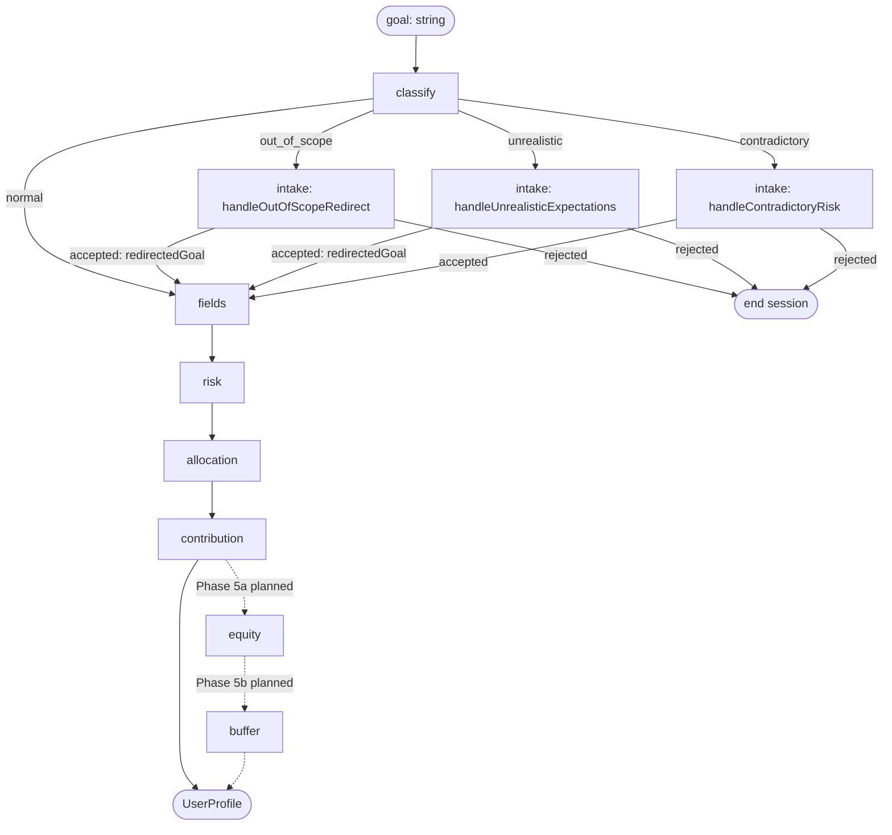

# Lazy Advisor — Architecture

An agentic investment planning CLI for beginner ETF investors. Inspired by the Israeli "Lazy Investor" philosophy — invest in ETFs, set up monthly contributions, stick to the plan, don't overthink it. The agent asks smart questions to clarify the user's investment situation and builds a structured investment profile.

> Educational/demonstrative project — not a licensed financial advisor. Target audience: beginner investors getting started, not experienced traders.

## Clarify Stage — Phases

Stage behavior, prompts, and rules are co-located with the stage at `src/server/pipeline/stages/clarify/`.

> Phases 1–8 shipped. `preferences` and `extraction` phases removed; classify → intake → fields → risk → allocation → contribution wired with typed I/O. Remaining: Phase 5a (equity) and 5b (buffer), after which `UserProfile` gains `equity` and `buffer` fields. See [`CLARIFY_REFACTOR_PLAN.md`](../CLARIFY_REFACTOR_PLAN.md) for per-phase specs and status.

Target execution order: **classify → intake (conditional) → fields → risk → allocation → contribution → equity → buffer**



| Phase | Job | Input → Output |
|-------|-----|----------------|
| classify | Label the goal: `normal`, `out_of_scope`, `unrealistic`, or `contradictory` | `goal` → `GoalClassification` |
| intake | Redirect misclassified goals; reject if user declines; extract clean `redirectedGoal` on acceptance (Phase 7d) | `goal`, classification → `IntakeResult` |
| fields | Collect core profile fields via conversation | `goal` → `FieldsPhaseOutput` |
| risk | Elicit a 1–5 self-rating of comfort with temporary drops; map deterministically to `conservative`/`moderate`/`aggressive` | `goal`, `FieldsPhaseOutput` → `RiskPhaseOutput` |
| allocation | Size the total-portfolio equity/buffer split from a 2-axis (risk tolerance × timeline) anchor table | `goal`, fields, risk → `AllocationPhaseOutput` |
| contribution | Establish one-time vs. periodic intent | `goal`, fields → `ContributionPhaseOutput` |
| equity | *(Phase 5a — planned)* Resolve which equity instruments fill the equity bucket + within-equity split | `goal`, fields, risk, allocation, contribution → `EquityPhaseOutput` |
| buffer | *(Phase 5b — planned)* Resolve which buffer instrument fills the buffer bucket | `goal`, fields, risk, allocation, equity → `BufferPhaseOutput` |

Each phase runs a `runPhaseLoop` tool-call loop with its own system prompt, then a post-loop structured extraction call produces the phase's typed output. A `*.rules.md` file is co-located with each phase (and at the stage root) as the behavior spec that drives prompts and evals. Cross-phase primitives — schemas, constants, types, and shared helpers — live under `clarify/shared/`.

## Stage Boundary Validation

The clarify stage output is validated with `UserProfileSchema`. If the LLM produces output that fails validation, the pipeline stops immediately and sends an `error` event — no retry. A malformed output means the LLM fundamentally misunderstood the task, and retrying the same prompt is unlikely to help. The user starts a new session.

## OpenAI Failure Handling

All OpenAI API calls use retry with exponential backoff (3 attempts). If all retries fail, nothing is saved. The pipeline sends an `error` event and the user retries from scratch.

---

## Design Decisions

### Multi-phase split

Splitting by responsibility keeps each prompt short and focused, improving instruction-following. Each phase has its own system prompt scoped to a single job, runs its own `runPhaseLoop`, and returns a typed structured output consumed by the next phase. Phases are decoupled: they receive plain typed inputs from the orchestrator rather than accumulating conversation state across boundaries. Evals are more targeted — each phase is tested independently, assertions are tighter, and failures are easier to isolate to a specific phase.

(Historical note: the initial implementation chained phases via `previous_response_id` with a single extraction call at the end. The refactor in [`CLARIFY_REFACTOR_PLAN.md`](../CLARIFY_REFACTOR_PLAN.md) replaces that with the typed I/O pipeline described above.)

### Phase loop guardrails

`runPhaseLoop` enforces a max tool call count to guard against the model not converging, and `collectToolOutputs` rejects any tool that isn't `ask_user`. Both violations throw `InternalError`.

### Classifier + intake routing

Some goals require handling before field collection can begin: stock picking requests need an ETF redirect, and unrealistic return expectations need a reality check. Embedding this branching logic in the fields prompt would create a "mega prompt" where routing decisions compete with field-collection instructions, degrading adherence (frontier models follow ~150–200 instructions reliably; complex branching consumes that budget fast).

The solution: move routing into code. A lightweight classifier (`classifyGoal`) makes a single structured LLM call and returns one of three values — `normal`, `out_of_scope`, or `unrealistic`. Code then routes to the appropriate intake phase before field collection begins:

```
"Should I buy NVIDIA stock?"
  → classifyGoal()             → out_of_scope
  → handleOutOfScopeRedirect   → IntakeResult { accepted: true, redirectedGoal }
  → collectFields(redirectedGoal ?? goal)
  → collectRisk → collectAllocation → ... → extractUserProfile
```

Each intake phase (`runPhaseLoop`) handles its specific conversation. Acceptance is determined by regex-matching the model's terminal phrase — `/got it/i` → accepted, anything else → rejected. The intake prompts instruct the model to respond with exactly `"Got it."` (accepted) or `"Understood."` (rejected, visible to user), making the signal deterministic enough for regex. The result is typed as `IntakeResult`:
- `{ accepted: true, redirectedGoal }` — the intake handler extracts a clean goal string capturing the accepted ETF redirect; orchestrator passes `redirectedGoal ?? goal` to `collectFields`
- `{ accepted: false }` — end the session; the stage sends a per-classification closing message from `INTAKE_REJECTION_MESSAGES`

The fields prompt is left with one job: collect required profile fields.

(The `contradictory` classification handles goals with conflicting risk signals like "maximum returns but I can't lose money." Although the risk phase's 1–5 self-rating collapses any goal-stated contradiction into the user's own comfort score, the `contradictory` intake phase is **kept** for its educational value: surfacing the contradiction up-front and aligning on what drops actually feel like is meaningful for beginner users, the target audience. Phase 7 originally planned to drop it; that decision was reversed.)

### Handlers as sub-agents; code as orchestrator

The classifier (`classifyGoal`) and intake handlers (`handleOutOfScopeRedirect`, `handleUnrealisticExpectations`) each live in their own subfolder under `clarify/intake/` alongside their evals and run logs. Each handler is a sub-agent in the practical sense: its own system prompt, its own `runPhaseLoop` tool-call loop, and a typed result (`IntakeResult`). The clarify stage orchestrates them explicitly in code after the classifier runs.

An alternative considered: skip the classifier entirely and expose the handlers as LLM tools, letting a single top-level agent decide which to call (tool-as-router). This collapses classify + route into one inference. It breaks down here because the handlers are multi-turn conversations — the tool's "execution" would itself involve nested LLM calls and user interaction. The outer agent would just wait, contributing nothing, making it a very expensive classifier.

The pattern works when the routed actions are simple and single-shot. When the actions are themselves stateful conversations, explicit code routing after a lightweight classifier is the right call: cheaper, independently testable, and each piece is observable in isolation.

### Risk phase — single 1–5 self-rating

The risk phase asks one question: a 1–5 self-rating of the user's comfort with seeing investments drop temporarily, with concrete behavioral anchors at 1 ("very uncomfortable — I'd want to sell immediately"), 3 ("neutral — I'd be uneasy but try to hold"), and 5 ("completely comfortable — I'd see it as a buying opportunity"). The integer is mapped deterministically in code: 1–2 → `conservative`, 3 → `moderate`, 4–5 → `aggressive`. The post-loop extraction call returns only `selfRatingScore`; `riskTolerance` is computed in TypeScript, not produced by an LLM.

**Why direct self-rating, not hypothetical drop scenarios.** Risk-tolerance research (Statman, Kitces, CFA Institute *Psychometric Review*) shows direct self-rating items have higher predictive validity than hypothetical scenario questions, and historical-recovery framing ("markets recovered from 2008 and 2020") is a documented priming bias specific to risk-tolerance questionnaires. An earlier two-turn A/B drop-scenario design also exhibited an intermittent prompt-adherence flake (~1 in 3–4 runs); the single-turn shape removes the multi-step flow entirely, so the flake disappears structurally. Full sources, trade-offs, and rejected alternatives (including a pension-past-behavior probe) live in [`clarify.risk.research-notes.md`](../src/server/pipeline/stages/clarify/risk/clarify.risk.research-notes.md).

**Default-on-unresolved is conservative, not moderate.** If the user gives an out-of-range or non-mappable answer twice (after one re-ask), the extraction defaults to `selfRatingScore: 1` → `conservative`. Under-sizing equity is recoverable; oversizing toward intolerance triggers exactly the panic-sell behavior the phase is meant to detect. The safer default does the right thing under uncertainty.

**`selfRatingScore` is preserved on the output** so the allocation phase (Phase 4b) can calibrate within a bucket if needed (e.g., distinguishing a "5" aggressive from a "4" aggressive). Mapping inside risk stays coarse on purpose — instrument granularity belongs to allocation, not classification.

### Allocation phase — 2-axis anchor (risk tolerance × timeline)

The allocation phase resolves the total-portfolio split between two buckets: equity (stocks / stock ETFs) and buffer (cash, money-market funds, short-term bonds). Output is two integers summing to 100. Instrument selection belongs to phases 5a and 5b.

**Why a separate phase.** Risk classification is only half the behavioral protection — sizing the equity bucket to tolerance is what makes the classification actionable. A conservative user at 40% equity experiences a 20% stock drop as an 8% total-portfolio drop, which contains the panic-sell behavior they self-reported. Cramming this decision into the equity phase would recreate the "preferences phase bloat" the refactor is built to eliminate.

The model locates the user's cell from `risk.riskTolerance` × interpreted timeline bucket and picks a specific integer inside the cell's range. The canonical anchor table and the four behavioral rules driving the conversation live in [`clarify.allocation.rules.md`](../src/server/pipeline/stages/clarify/allocation/clarify.allocation.rules.md); the research basis is in [`clarify.allocation.research-notes.md`](../src/server/pipeline/stages/clarify/allocation/clarify.allocation.research-notes.md).

The `<3yr` column collapses across all tolerances — at that horizon, capacity (the money still being there when needed) dominates risk tolerance per Vanguard, Fidelity, and Bogleheads guidance.

**Shekel math discipline.** The prompt includes explicit arithmetic instructions (`equity = amount × equityPercentage ÷ 100`; `buffer = amount − equity`; verify sum before sending) with a worked example. An earlier eval run surfaced a bug where the model stated "₪85,000 + ₪15,000" for a ₪50,000 investment; every eval case now asserts the transcript contains the correct shekel amounts. A follow-up refactor to move the math from the model into code is a deferred architecture improvement — tracked in [STATUS.md § Deferred follow-ups](./STATUS.md#deferred-follow-ups).

**What's not used by this phase.** `hasEmergencyFund` and `hasDebt` are collected upstream but the allocation phase does not consume them. An earlier design treated them as mid-conversation suitability qualifiers; the heads-up was dropped as weak ROI. Whether to gate the clarify stage on EF/debt *before* field collection — an intake-rejection-style suitability gate — is a separate Phase 7 decision tracked in [STATUS.md § Deferred follow-ups](./STATUS.md#deferred-follow-ups). Age is also unused: redundant with timeline per TDF glidepath literature.

### `plansToContribute: boolean` instead of `monthlyContribution: number`

Users contribute on irregular schedules (every 2–3 months, every 6 months, etc.), and capturing a fixed monthly number creates a false precision problem: the number is hard to collect accurately and downstream predictions based on it would likely be wrong or misleading. A boolean is sufficient for the downstream use case — adjusting plan examples and projections for "contributes periodically" vs. "one-time investment." If a specific amount ever becomes necessary, it belongs in a later, dedicated phase.

### No extraction phase — inline assembly from typed outputs

The original pipeline ended with an LLM extraction call that read the full cross-phase conversation and assembled a `UserProfile`. This was replaced by inline assembly in `clarify.stage.ts`: each phase returns a typed output, and the stage spreads them directly into the profile object before a final `UserProfileSchema.parse()` boundary check.

The extraction phase is permanently removed. Typed phase outputs make assembly trivial — there is no summation or inference step left, just field mapping. The goal-summary LLM call (the one remaining job extraction had) is dropped entirely: nothing downstream currently consumes a goal summary string, and a raw `goal` string is passed directly to downstream stages instead.

### Fields phase takes `goal: string` directly

The intake handlers are short redirections; their LLM conversation context adds little value to the fields phase. Instead, a later refactor phase will build an enriched goal string that incorporates any relevant intake context explicitly and passes it to fields as a clean typed input. This is simpler and more testable than threading a `previous_response_id` through two unrelated phases.
